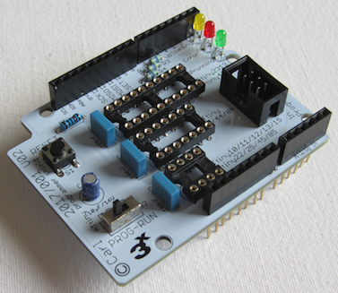
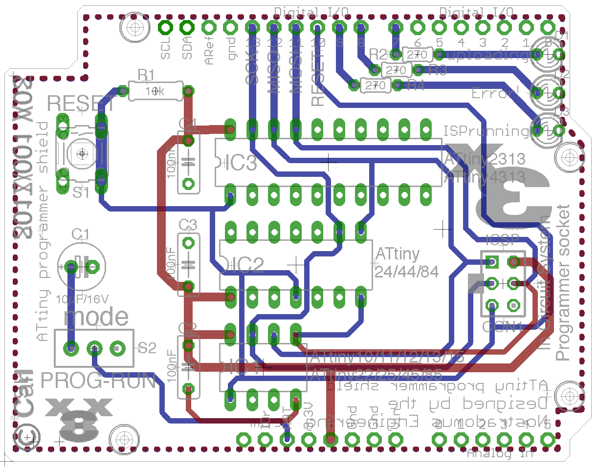
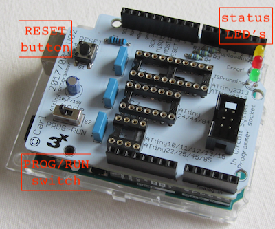

# ATtiny ISP programmer shield for Arduino UNO boards

## What

This repo provides you with all necessary info (and files) to build an Arduino shield to program Atmel's **attiny** 𝜇-controllers. For that matter, the underlying Arduino board should be loaded with the ISP-programmer sketch (built-in example).

 

## Why

Often, one of these "tiny" chips is largely powerful enough for the design of small projects. During the design phase, I however got tired of wiring up things on a breadboard. As (like many people) I was having a spare UNO, which could serve as an ISP programmer, I decided to design a minimalistic shield to fit on top of it.  

## How

The shield has been designed with EAGLE from AutoDesk/CadSoft. This shield [project](eagle-files/) can be opened with the free version [(download here)](http://www.autodesk.com/products/eagle/free-download). In order to keep things simple, the V1 PCB can be etched single-sided, as the top-layer only contains a couple of short connections (which can easily be replaced by wire-bridges). The V2 PCB (a real double-sided version) has optimised routing and ground-pours. Only [through-hole components](BOM.md) have been used in order to make the built also feasible for any beginner. In the [pdf-folder](pdf-files/) of this repo pdf versions of all important EAGLE views are available, for those not wanting to install EAGLE. Pay attention to print the bottom and top-layer layouts **without re-sizing** (1:1). To have the printed circuit board built by a commercial PCB-shop, the [gerber-files](gerber-files/) are also available. A series of V2 PCB's is still available in our workshop.

## Technical details

### What’s on the board

The board is fit with 3 IC sockets (8, 14 and 20 pin), for the 3 types attiny’s. **Only one chip should be fit at a time** :exclamation: On the prototype, pin headers with double functionality have been mounted. Pins on the bottom-side to fit on the Arduino board, and feed-through female headers on the top for easy access of all Arduino connections.
The push button, is connected to the reset lines of the attiny’s with a 10kΩ pull-up resistor. When the shield is cut correctly, the reset button for the Arduino UNO itself should still be accessible. In order to make the Arduino Uno work as an ISP programmer a 10µF capacitor needs to be connected on its reset-line.
Three LED’s are available to visualise the correct functionality of the programming procedure.
An optional AVR ISP socket has been foreseen in order to use the shield as stand-alone with a commercial programmer.

#### BOM - bill of materials

Part | Value | Package | Description  
---- | ----- | ------- | -----------                            
R1     | 10kΩ           | 0207/7         | resistor                                            
R2,3,4 | 270Ω           | 0207/7         | resistor                                            
C1     | 10µF/16V       | E2,5-6E        | polarized capacitor                                 
C2,3,4 | 100nF          | C050-025X075   | capacitor                                           
LED1   | 3mm yellow     | 3mm            | LED                              
LED2   | 3mm red        | 3mm            | LED                              
LED3   | 3mm green      | 3mm            | LED                                                                                             
IC1    | 8-pin          | DIL08          | IC socket                                                            
IC2    | 14-pin         | DIL14          | IC socket                                                                     
IC3    | 20-pin         | DIL20          | IC socket                                                                     
ICSP1  | 2x3 pin-header | 2x3            | AVR ISP-6 Serial Programming Header (optional)                                 
S1     | momentary      | 6x6x6mm        | momentary tact push button
S2	   | SPDT	          | MINI SWITCH 90 | mini toggle switch
CON1,2 | 6-pin          | SIL06          | long needle female stackable pin header strip
CON3   | 8-pin          | SIL08          | long needle female stackable pin header strip
CON4   | 10-pin         | SIL10          | long needle female stackable pin header strip

### How things work

First the the [ISP-programmer sketch](sketches/ArduinoISP.ino) (built-in example) should be loaded to the Arduino UNO board. During that operation, the blue jumper (JP1) should be removed. Select “Arduino Uno” as target board in the tools-menu. Load the ISP-programmer sketch with the “UPLOAD” button. Once loaded, the jumper can be put back to send your a sketch to your attiny 𝜇-controller.

  

To load a sketch to your attiny chip, make sure that the correct target board is selected in the tools-menu (you might need to download a specific library -> tools-menu, board manager). This time, use the “UPLOAD USING PROGRAMMER” option from the sketch-menu.

 

The 3 LED’s will tell you how things are going :
 - Green  : ISP programmer running
 - Yellow : uploading sketch
 - Red    : error  

### Proof of concept

So far, I have tested the shield with the below list of 𝜇-controllers :
 - attiny84
 - attiny85
 - attiny2313
 - attiny4313

 Any pin-compatible 𝜇-controller should work as well :
 - 8-pin  : attiny10/11/12/13/15/22/25/45/85
 - 14-pin : attiny24/44/84
 - 20-pin : attiny2313/4313
 (on condition of using the correct settings in your Arduino programming environment)

## Contributors

If you are having any good suggestions, just drop me a line [:email:](http://nostradomus.ddns.net/contactform.html).
If feasible, I'll be happy to implement proposed improvements.
And if you are having lots of time, I'll be happy to share the work with you ;-).

## :globe_with_meridians: License

There is no specific license attached to this shield.
If you like it, have fun with it (at your own risk of course :-D).
Oh, and when using anything from this repository, it is highly appreciated if you mention its origin.
